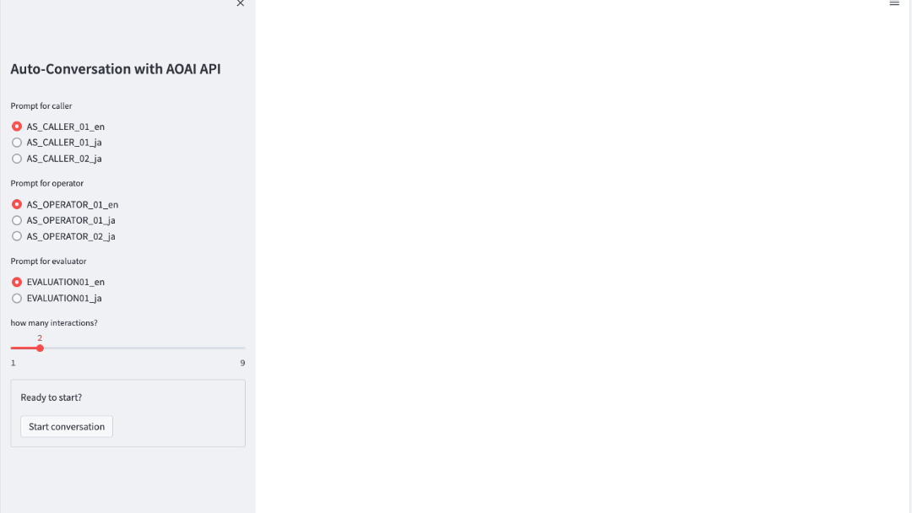

# EvaluationWithAutoConversation

This repository provides you several features about automatic generation of conversation and their evaluation with GPT models. Some typical prompts are ready in `./prompts` directory botn in English and Japanese. They enable you to generate conversation and evaluation by yourself.

This feature can accelerate your understanding about how the prompts help your amazing apps, and ideas for testing with prompts based on GPT-technology. You can see the entire experience as below:




We recommend to run the app before analyzing the codes.


# Main features
- `Automatic conversation generation` with prompts. Our conversations consist of two people -caller and operator- who interact with each other.
    - For caller: He/She starts the conversation as caller, who aligns to the scenario defined in [caller_prompts](./prompts/caller_prompts.yml)
    - For operator: He/She replies the conversation as operator, who aligns to the scenario defined in [operator_prompts](./prompts/operator_prompts.yml)
    - The function `generate_conversation` in [commons.py](./src/common.py) controls the entire conversation between caller and operator.
- After generating the entire conversation, `Evaluation` runs with [evaluation prompt](./prompts/evaluation.yml).


# How to use

1. Prepare your `python` environment
    ```sh
    pip install -r ../requirements.txt
    ```

2. Provision the [Azure OpenAI Service](https://learn.microsoft.com/en-us/azure/ai-services/openai/).

3. Prepare `config.yml` in root directory with the following format:

    ```yml
    AOAI:
        ENDPOINT: 'https://XXX.openai.azure.com/'
        KEY: 'YYY'
        VERSION: "2024-02-01"
        MODEL: "gpt-4o"
        PARAMTERS: 
            TEMPERATURE: 0.7
            MAX_TOKENS: 4000
            TOP_P: 0.95
            FREQUENCY_PENALTY: 0
            PRESENCE_PENALTY: 0
    ```

    Specify appropriate values:
    - `AOAI`
        - `ENDPOINT`: AOAI Endpoint
        - `KEY`: Key value related to `ENDPOINT`
        - `VERSION`: version you use
        - `MODEL`: Model name you use
        - `PARAMETERS`: Some parameters for AOAI. Please make sure the concrete meaning in [this site](https://learn.microsoft.com/en-us/azure/ai-services/openai/reference).
        

4. Run the app
    ```sh
    > streamlit run ./app.py
    ```
    Please refer [Get started in Streamlit](https://docs.streamlit.io/get-started) in detail.

5. Supllmentary material
    ```sh
    > jupyter notebook
    ```
    Use [AutoConversation.ipynb](./AutoConversation.ipynb).

## References
- [Azure OpenAI](https://learn.microsoft.com/en-us/azure/ai-services/openai/)
- [Stramlit API](https://docs.streamlit.io/develop/api-reference)
- [Streatmlit-chat](https://github.com/AI-Yash/st-chat)