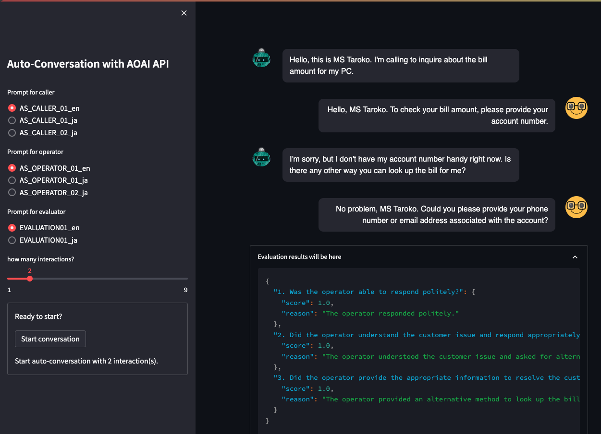

# EvaluationWithAutoConversation

This repository provides you features for automatic generation of conversation and their evaluation with GPT models. Some typical prompts are ready in `./prompts` directory botn in English and Japanese. They enable you to generate conversation and evaluation by yourself.

This feature can accelerate your understanding about how the prompts help your amazing apps, and ideas for testing with prompts based on GPT-technology.




# configuration file
Please prepare `config.yml` in root directory with the following format:

```yml
AOAI:
    ENDPOINT: 'https://XXX.openai.azure.com/'
    KEY: 'YYY'
    VERSION: "2024-02-01"
    MODEL: "gpt-4o"
    PARAMTERS: 
        TEMPERATURE: 0.7
        MAX_TOKENS: 4000
        TOP_P: 0.95
        FREQUENCY_PENALTY: 0
        PRESENCE_PENALTY: 0
```

Specify appropriate values:
- `AOAI`
    - `ENDPOINT`: AOAI Endpoint
    - `KEY`: Key value related to `ENDPOINT`
    - `VERSION`: version you use
    - `MODEL`: Model name you use
    - `PARAMETERS`: Some parameters for AOAI. Please make sure the concrete meaning in [this site](https://learn.microsoft.com/en-us/azure/ai-services/openai/reference).
        

# How to use

1. Prepare your `python` environment
    ```sh
    pip install -r ../requirements.txt
    ```

2. Run the app
    ```sh
    > streamlit run ./app.py
    ```
    Please refer [Get started in Streamlit](https://docs.streamlit.io/get-started) in detail.

3. Supllmentary material
    ```sh
    > jupyter notebook
    ```
    Use [AutoConversation.ipynb](./AutoConversation.ipynb).

## References
- [Azure OpenAI](https://learn.microsoft.com/en-us/azure/ai-services/openai/)
- [Stramlit API](https://docs.streamlit.io/develop/api-reference)
- [Streatmlit-chat](https://github.com/AI-Yash/st-chat)